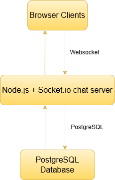
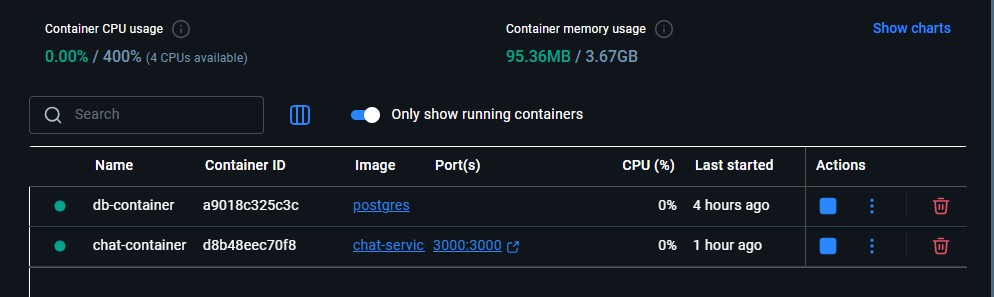
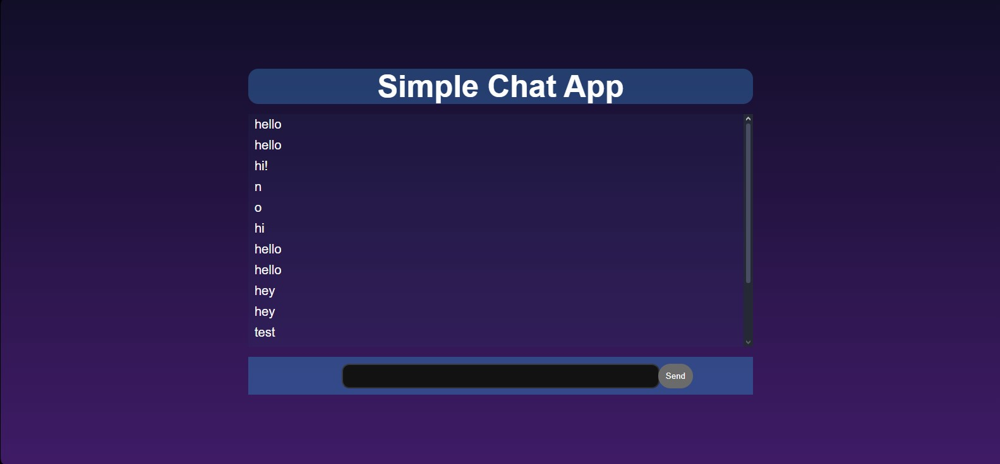
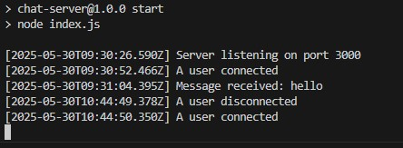

# Chat Application - Real-time Messaging Platform
A basic real time chat application built using node.js and socket.IO, allowing users to send and recieve messages instantly via browser interface. The application supports multiple users and saves all chat messages in PstgreSQL database. it demonstrates the use of Docker to containerize services and simplify setup and deployment.

## Use Case
Students or users can connect to a shared chat room, communicate in real-time and have their messages stored securely.

## Microservices Architecture
This application uses 2 service architecture:

### Chat Server Service
with the help of Node.js and Socket.IO, user can send and recieve messages in real time and manages websocket connections from clients.

### PostgreSQL Database Service
Stores messages and also helps to retrive chat history from database.

## Tech Stack

 - Chat Server: Node.js, Socket.IO
 - Database: Postgre.SQL
 - Docker: Docker, DockerCLI

## Docker Usage
 - Containers will be used for	Each service (chat server and database) to runs in its own container
 - Networking will be used for	a custom Docker bridge network (app-network) which connects both services
 - Volumes will be used for a Docker volume (db-data) to persist PostgreSQL data
 - Dockerfile will be used for	a custom Dockerfile which is written for the Node.js chat service
 - Healthcheck will be used for the Node.js container which includes a HEALTHCHECK instruction

## Creative Enhancement: Custom Logging with Docker Logs

A custom timestamp logging mechanisim is implemented in `index.js` file, which:

- Track all user connections and disconnections.
- Log every chat message with a precise timestamp.
- Identify and debug errors with clear contextual logs.

By using `docker logs chat-container`, these logs can be accessed in real-time, offering transparency and helpful diagnostics without any third-party tools.

This showcases Docker's native logging integration with application behavior.

## Setup instructions

through git you can:

                            git clone https://github.com/Mahi-iqbal12/chat-app.git
                            cd chat-app
                            cd chat-server
                            docker build -t chat-service .
                            docker run -d --name chat-container -p 3000:3000 chat-service

if manually installing this zip folder and extracting it, open this folder Chat-app visual studio. Open the terminal and write the following commands:

                            cd .\ Chat-server
                            docker build -t chat-service .
                            docker run -d --name chat-container -p 3000:3000 chat-service

to view the logs, write:

                            docker logs -f chat-container

application will run at `http://localhost:3000`

## Screenshots and URL

Docker hub url: `https://hub.docker.com/repositories/mahi1213`

